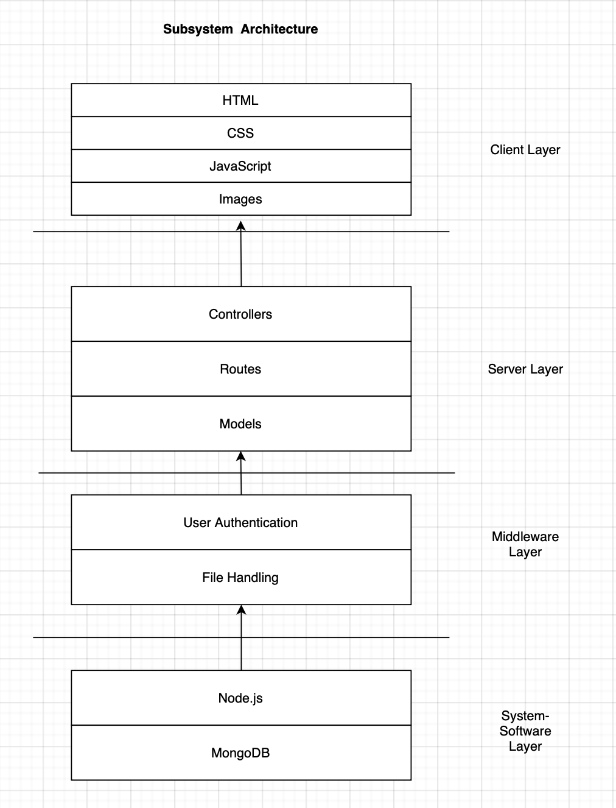
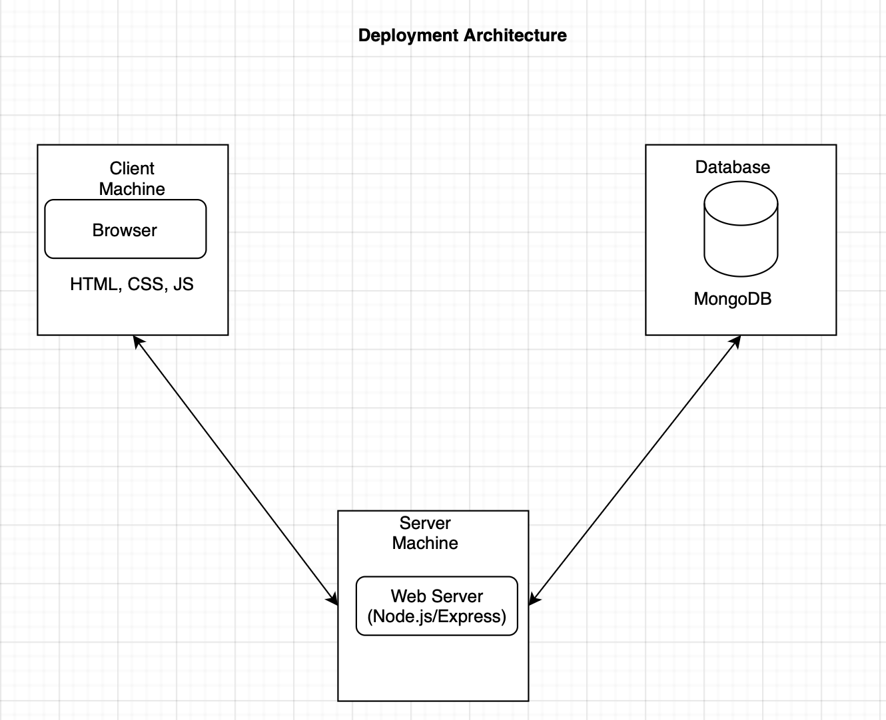
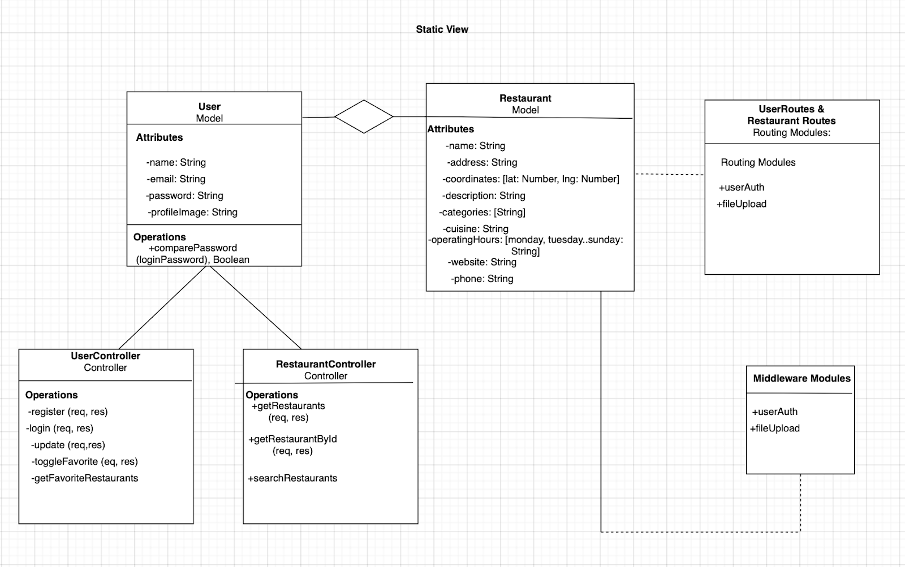
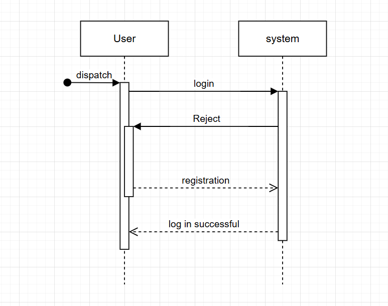
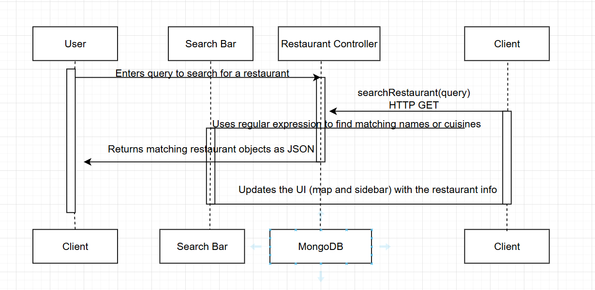

# FoodMatch

A simple web app that helps students find dining options around campus based on their dietary preferences. Users can register, log in, set filters, favorite restaurants, and view detailed info on a map.

---

## Table of Contents

1. [Project Overview](#1-project-overview)
2. [Features](#2-features)
3. [Tech Stack](#3-tech-stack)
4. [Architectural Overview](#4-architectural-overview)
5. [Prerequisites](#5-prerequisites)
6. [Getting Started](#6-getting-started)
7. [Usage](#7-usage)
8. [API Endpoints](#8-api-endpoints)
9. [Testing](#9-testing)

---

## 1. Project Overview

Students on campus with specific dietary constraints often have trouble finding alternatives that meet their requirements. **FoodMatch** intends to bridge this gap by offering a user-friendly web application that allows students to filter restaurants based on cuisine and dietary restrictions, explore detailed restaurant information on an interactive map, and save their favorite locations.

The main stakeholders for this project include:
* **Students**: Primary users looking for food choices that accommodate their dietary restrictions.
* **Restaurant Owners**: Beneficiaries who can attract a certain customer demographic.
* **University Administration**: Interested in improving campus life and accessibility.

---

## 2. Features

* **Secure Authentication**: Register and log in with email/password. Passwords are hashed and sessions use JWT.
* **Dietary Filters**: Filter restaurants by categories like Vegan, Halal, Gluten-Free, etc..
* **Interactive Map**: A Leaflet-powered map shows restaurant locations. Clicking a sidebar item pans and flies the map to that location.
* **Favorites**: Mark restaurants as favorite and quickly view them on a dedicated page.
* **Profile Management**: Upload a profile picture, update name, email, and password.
* **Responsive Layout**: The design works on desktop browsers and mobile devices.

---

## 3. Tech Stack

* **Frontend**: HTML, CSS, JavaScript, [Leaflet.js](https://leafletjs.com/).
* **Backend**: Node.js, Express.
* **Database**: MongoDB with Mongoose.
* **Authentication**: JSON Web Tokens (JWT).
* **File Uploads**: Multer.

---

## 4. Architectural Overview

The system follows a **Client-Server Model** which allows for a clear separation between the client and server. It uses a **Layered Architecture** that separates concerns, making it simple to implement and scalable.

### Subsystem Architecture

The architecture is divided into clear layers to separate issues and improve maintainability.



### Deployment Architecture

The system is deployed in a distributed style, with the client running on a browser and the server hosted on a single machine that connects to a MongoDB database.



### Static View

This view demonstrates the class responsibilities and the relationships between the `User` and `Restaurant` models, controllers, and routing modules.



### Dynamic View

This view illustrates the control flow for key user interactions, such as registration/login and restaurant searches.





---

## 5. Prerequisites

* **Node.js** v14+
* **MongoDB** running locally or via a cloud provider

---

## 6. Getting Started

### 1. Clone the Repo

```bash
git clone https://github.com/Ahmad-Elhatto/FoodMatch.git
cd FoodMatch
````

### 2\. Install Dependencies

```bash
# From the project root, install all server-side packages
npm install
```

### 3\. Configure Environment

Create a file named `.env` in the root of the project and base it off `.env.example`:

```dotenv
MONGO_URI=mongodb://127.0.0.1:27017/foodRecommender
JWT_SECRET=7b96a77ebf13a81f46db649c2bb122501f05cbc6552fdc2f16849a8d8a34ff32
```

### 4\. Seed the Database

Populate the restaurants collection with sample data. This script will connect to your MongoDB, clear out any existing entries, and insert the predefined restaurant records:

```bash
node server/seeds/seedRestaurants.js
```

### 5\. Run the Server

```bash
node server/start
```

### 6\. Open the Client

Open the `client/register.html` file in your browser to start on the registration page.

> **Tip:** If your browser blocks the `fetch()` calls due to CORS, serve the `client/` folder via a simple HTTP server (e.g., VSCode Live Server or `npx http-server`) instead of opening the files directly.

-----

## 7\. Usage

1.  **Register**

      - Open `register.html` in your browser.
      - Fill in your **Name**, **Email**, **Password**, and upload a **Profile Picture**.
      - Click **Register** to create your account.

2.  **Log In**

      - After successful registration, you’ll be redirected to `login.html`.
      - Enter your email and password, then click **Sign In**.

3.  **Browse Home**

      - On `home.html`, use the **Filters** icon to choose dietary preferences.
      - Click a restaurant in the sidebar to fly the map to its location and view a small popup.
      - A detailed floating box appears next to the sidebar showing full restaurant info. Click the **X** or click outside to close it.

4.  **Favorites**

      - Click the ❤️ on any restaurant card to favorite it.
      - Navigate to `favorites.html` via the favorites icon in the header to see all your saved restaurants.
      - In the favorites page, click a card to fly the map there or click the ❤️ again to unfavorite.

5.  **Profile & Settings**

      - Click the **Settings** icon in the header, then **Account & Settings** to open `profile.html`.
      - View or update your **Name**, **Email**, **Password**, and **Profile Picture**.
      - Changes are saved via the **Save Changes** button.

6.  **Navigation**

      - Use the **FoodMatch** logo in the header to return to the home page at any time.
      - Use the header dropdown to jump between **Home**, **Favorites**, and **Profile**.

-----

## 8\. API Endpoints

### Users

| Method | Endpoint                             | Description                                                              |
| ------ | ------------------------------------ | ------------------------------------------------------------------------ |
| POST   | `/api/users/register`                | Register a new user (multipart/form-data: name, email, password, profileImage) |
| POST   | `/api/users/login`                   | Log in and receive a JWT                                                 |
| PUT    | `/api/users/profile`                 | Update name, email, password, and/or profile picture (protected)         |
| GET    | `/api/users/favorites`               | Get all favorite restaurants for the authenticated user                  |
| POST   | `/api/users/favorites/:restaurantId` | Toggle favorite/unfavorite a restaurant (protected)                      |

### Restaurants

| Method | Endpoint                                    | Description                                                           |
| ------ | ------------------------------------------- | --------------------------------------------------------------------- |
| GET    | `/api/restaurants`                          | Get all restaurants; optionally filter by categories with `?categories=Vegan,Halal,…` |
| GET    | `/api/restaurants/search?query=<term>`      | Search restaurants by name or cuisine matching the given query        |
| GET    | `/api/restaurants/:id`                      | Get detailed information for a single restaurant by its ID            |

-----

## 9\. Testing

### Frontend Testing

You’ll need three separate terminals:

1.  **Terminal 1 – Start the backend**

    ```bash
    npm start
    ```

    Boots up the Express server, connects to MongoDB, and initializes all API routes.

2.  **Terminal 2 – Serve the client**

    ```bash
    npm run serve:client
    ```

    Spins up a lightweight HTTP server for your frontend. By default it runs at `http://localhost:4000`; if port 4000 is already in use, it picks another port and copies that URL to your clipboard.

3.  **Terminal 3 – Run the frontend tests**
    ```bash
    npm run test:frontend
    ```
    
    If your serve step used a different port, export it first:

    ```bash
    CLIENT_URL=http://localhost:<your-port> npm run test:frontend
    ```

    Run this **last**, so your tests point to the correct frontend URL.

### Backend Testing

1.  **Stop all running servers**: In **every** terminal, press <kbd>Ctrl</kbd>+<kbd>C</kbd> to make sure no instances of the backend (or frontend serve) are running.

2.  **Run the backend test suite**

    ```bash
    npm run test:backend
    ```

    Executes unit and integration tests for models, routes, and controllers.

<!-- end list -->